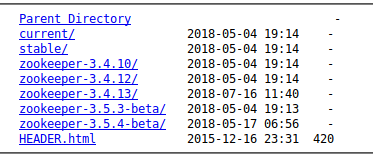
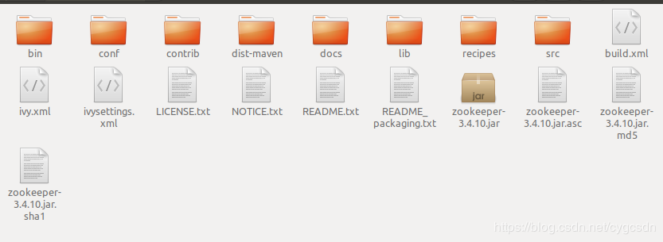

# ubuntu安装配置zookeeper和kafka

## (一)zookeeper

### 1.下载zookeeper
下载地址: http://apache.fayea.com/zookeeper/
我用的3.4.10版本的

### 2.解压zookeeper
解压后的目录结构

### 3.配置zookeeper
进入 conf文件夹下,有一个zoo_sample.cfg文件,这是一个简单的配置例子,我们需要将它改名为 zoo.cfg,我是复制重命名的,并且把带#的注释去了

### 4.启动zookeeper
在bin目录下
./zkServer.sh start
可以测试一下是否启动成功
在bin目录下
./zkCli.sh
ok , zookeeper的单机版已经部署成功了

## (二)kafka

### 1.下载kafka
下载地址:http://apache.fayea.com/kafka/2.1.0/

### 2.解压kafka

解压后的根目录结构如下

### 3.启动kafka服务

在bin目录下,启动,指定根目录config下的配置文件,不要关闭该终端
./kafka-server-start.sh ../config/server.properties

### 4.创建topic

在bin目录下
./kafka-topics.sh --create --zookeeper localhost:2181 --replication-factor 1 --partitions 1 --topic test
### 5.查看topic

在bin目录下
./kafka-topics.sh --list --zookeeper localhost:2181

### 6.产生消息，创建消息生产者

在bin目录下
./kafka-console-producer.sh --broker-list localhost:9092 --topic test

### 7.消费消息，创建消息消费者,在生产者中发送的消息都会出现在消费者中

在bin目录下
./kafka-console-consumer.sh --bootstrap-server localhost:9092 --topic test --from-beginning

这样本机的kafka环境就搭建好了
---------------------------------------------------------------------
